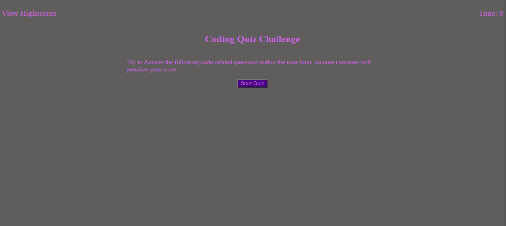

# Code-quiz

## description 

Create a webpage from scratch to quiz yourself and keep the score between attempts. Highscores are on a separate page. On quiz start user is given a 75-second timer to complete the quiz. Wrong answers will be penalized and correct answers progress the quiz. The quiz is completed when the 4 questions are answered or the time reaches 0.

## [Deployed Project](https://maxwell-leu.github.io/Code-quiz/)

